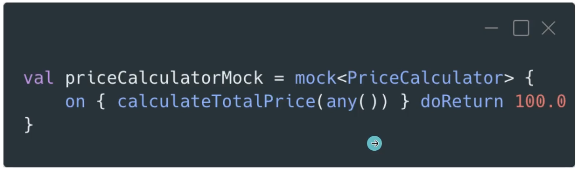

# 3. DOBLES DE TEST


## ¿Qué son los dobles de test?:

- Se utilizan para simular el comportamiento de una dependencia de una aplicación en un entorno de pruebas, sin depender de la implementación real.
	- Permite realizar pruebas aisladas de una parte específica de la aplicación.
	- Abstracción de dependencias externas.
	- Controlar el comportamiento de esas dependencias.
- Hablaremos de 5 tipos de dobles de test:
	- Dummy
	- Stub
	- Fake
	- Spy
	- Mock


## Dummy:

- Es el más sencillo de todos: lo que hace es proporcionar una implementación vacía.
- Cumple con la firma de un método o interfaz.
- Nunca se va a llamar, porque realmente no tenemos intención de utilizar el objeto, solo queremos que cumpla con la firma para que el código compile.
- Por ejemplo en el siguiente código queremos testear la función `finishOrder()` pero necesitamos pasarle una `creditCard` al objeto `Customer` para poder crearlo, pero en la función que queremos testear, no se utiliza la `creditCard`, por tanto creamos un dummy para esta clase.

	```
	interface CreditCard {
		fun charge(amount: Double)
	}

	class CreditCardDummy : CreditCard {
		override fun charge(amount: Double) {
			// no hacemos nada
		}
	}

	class Costumer(val creditCard: CreditCard) {
		fun makePayment() {

		}

		fun finishOrder() {
			// en esta función no se utiliza la variable creditCard
		}
	}

	fun main() {
		val customer = Customer(CreditCardDummy())
		customer.finishOrder()
	}

	```


## Stub:

- Se utilizan para simular el comportamiento de una dependencia en un entorno de pruebas.
- Proporcionan respuestas predefinidas para ciertas entradas, son muy útiles para probar como se comporta la aplicación en diferentes esecenarios.
- Devuelven el mismo valor independientemente del contexto.
- Puede tener una pequeña lógica en función del valor de entrada.
- Se diferencia del `dummy` en que en este caso, si que vamos a utilizar el valor de returno del doble de test `stub`.
	```
	interface DiscountService {
		fun getDiscount(costumer: Costumer): Double
	}

	class DiscountServiceStub : DiscountService {
		override fun getDiscount(customer: Customer): Double = 0.1
	}

	class Customer {
		fun getDiscount(discountService: DiscountService): Double = discountService.getDiscount(this) // this = costumer
	}

	fun main() {
		val customer = Costumer()
		val discountService = DiscountServiceStub()
		customer.getDiscount(discountService)
	}
	```	


## Fake:

- Imitan el comportamiento real.
- Implementación simplificada.
- Útiles cuando la dependencia es compleja o cuesta mucho trabajo configurarla para un entorno de pruebas.
- El típico ejemplo de un `fake` es la base de datos, persistirla en memoria como por ejemplo en un array en vez de en disco.
- La principal diferencia con los anteriores es que se asemejan más a la realidad y suelen ser más reutilizables.

	```
	class Email

	interface EmailService {
		fun sendEmail(email: Email)
		fun getSentEmails(): List<Email>
	}

	class EmailServiceFake: EmailService {

		private val sentEmails = mutableListOf<Email>()

		override fun sendEmail(email: Email) {
			sentEmails.add(email)
		}

		override fun getSentEmails(): List<Email> = sentEmails
	}

	class Customer {
		fun sendEmail(emailService: EmailService, email: Email) {
			emailService.sendEmail(email)
		}
	}

	fun main() {
		val customer = Customer()
		val emailService = EmailServiceFake()
		customer.getDiscount(discountService)
	}
	```


## Spy:

- Registran el comportamiento de una dependencia durante una prueba.
- Permiten verificar su correcto funcionamiento.
- Mientras que un `fake` comprueba que el estado final es el correcto (imita el comportamiento), un `spy` comprueba que se ha llamado a las funciones correspondientes (registra el comportamiento).

	```
	class Product

	interface ShoppingCart {
		fun addItem(product: Product)
	}

	class ShoppingCartSpy : ShoppingCart {
		var addItemCalled = false

		override fun addItem(product: Product) {
			addItemCalled = true
		}
	}

	class Customer {
		fun addItemToCart(shoppingCart: ShoppingCart, product: Product) {
			shoppingCart.addItem(product)
		}
	}

	fun main() {
		val customer = Customer()
		val shoppingCart = ShoppingCartSpy()
		customer.addItemToCart(shoppingCart, Product())

		assertTrue(shoppingCart.addItemCalled)
	}
	```

## Mock:

- También verifican el comportamiento.
- No se basan en la implementación real.
- Control total del comportamiento durante los tests. No solo nos permiten verificar datos, sino también configurar qué queremos que ocurra cuando se llame a alguna de sus funciones, qué valores queremos que se devuelvan.
- Uso de librerías como Mockito o MockK.
- Verificar que se ha llamado a cierta función con ciertos valores.




## Tests de estado vs interacción:

- Dobles de Estado: Dummy, Stub, Fake. -> Tests de caja negra: Sobreviven a refactorizaciones pero hay algunos tests que no se pueden implementar (por ejemplo los de interacción/verificación).
- Dobles de Interacción: Spy, Mock. -> Tests de caja blanca: Más frágiles porque se basan en la implementación específica, si cualquier detalle de esta implementación cambia, seguramente el test deje de compilar.


## Ejemplos:

- Dado el siguiente código:

```
class MoviesRepository(
    private val moviesLocalDataSource: MoviesLocalDataSource,
    private val moviesRemoteDataSource: MoviesRemoteDataSource
) {

    fun findAll(): List<Movie> {
        if (moviesLocalDataSource.isEmpty()) {
            val movies = moviesRemoteDataSource.findPopularMovies()
            moviesLocalDataSource.saveAll(movies)
        }
        return moviesLocalDataSource.findAll()
    }

}

interface MoviesLocalDataSource {
    fun isEmpty(): Boolean
    fun saveAll(movies: List<Movie>)
    fun findAll(): List<Movie>
}

interface MoviesRemoteDataSource {
    fun findPopularMovies(): List<Movie>
}
```

- Para hacer un test que retorne las peliculas de fuente local si esta no está vacía:
	- En este caso voy a querer los datos de local, por tanto el remote data source puede ser un dummy -> `MoviesRemoteDataSourceDummy`
	- El local si que necesito que devuelva algo, por lo menos un estado, en este caso puede ser siempre el mismo valor -> `MoviesLocalDataSourceStub` 
	- La función `saveAll` de `MoviesLocalDataSourceStub` la podemos dejar con un to do porque en este caso no lo vamos a usar.

	```
	class MoviesRemoteDataSourceDummy: MoviesRemoteDataSource {
    	override fun findPopularMovies(): List<Movie> {
        	TODO("not yet implemented")
    	}
	}

	class MoviesLocalDataSourceStub: MoviesLocalDataSource {
    	override fun isEmpty(): Boolean = false
    	override fun saveAll(movies: List<Movie>) {
        	TODO("Not yet implemented")
    	}
    	override fun findAll(): List<Movie> = listOf(Movie(1, "Movie 1"))
	}

	class SampleTest {

    	@Test
    	fun `getMovies() returns a list of local movies if local data source is not empty`() {
        	val moviesLocalDataSource = MoviesLocalDataSourceStub()
        	val moviesRemoteDataSource = MoviesRemoteDataSourceDummy()
        	val moviesRepository = MoviesRepository(moviesLocalDataSource, moviesRemoteDataSource)

        	val movies = moviesRepository.findAll()

        	assertEquals(1, movies[0].id)
    	}
	}
	```


- Ahora queremos probar un caso en el que el remoto devuelve las peliculas porque en el local no hay nada:
	- También queremos probar que las peliculas se almacenan correctamente en el local.
	- Tenemos que transformar el `stub` en un `fake` -> `MoviesLocalDataSourceFake` simulando que es un componente real pero con una implementación simplificada.
	- El remote ahora tiene que devolver valores por tanto transformamos el `dummy` en un `stub` -> `MoviesRemoteDataSourceStub`.
	```
	class MoviesRemoteDataSourceStub: MoviesRemoteDataSource {
    	override fun findPopularMovies(): List<Movie> = listOf(
        	Movie(1, "Movie 1"),
        	Movie(2, "Movie 2")
    	)
	}

	class MoviesLocalDataSourceFake: MoviesLocalDataSource {
    	private val movies = mutableListOf<Movie>()
    	override fun isEmpty(): Boolean = movies.isEmpty()
    	override fun findAll(): List<Movie> = movies
    	override fun saveAll(movies: List<Movie>) {
        	this.movies.addAll(movies)
    	}
	}	

	class SampleTest {
    	@Test
    	fun `getMovies() returns a list of local movies if local data source is not empty`() {
        	val moviesLocalDataSource = MoviesLocalDataSourceFake()
        	val moviesRemoteDataSource = MoviesRemoteDataSourceStub()
        	val moviesRepository = MoviesRepository(moviesLocalDataSource, moviesRemoteDataSource)

        	val movies = moviesRepository.findAll()

        	assertEquals(1, movies[0].id)
    	}

    	@Test
    	fun `findAll() returns a list of remote movies if local data source is empty`() {
        	val moviesLocalDataSource = MoviesLocalDataSourceFake()
        	val moviesRemoteDataSource = MoviesRemoteDataSourceStub()
        	val moviesRepository = MoviesRepository(moviesLocalDataSource, moviesRemoteDataSource)

        	val movies = moviesRepository.findAll()

        	assertEquals(1, movies[0].id)
        	assertEquals(2, movies[1].id)
    	}
	}
	```

- En caso de que nos queramos asegurar que lo que nos está devolviendo es lo que está en el data source local, y que está llamando a las funciones que tocan, podríamos convertir el `fake` en un `spy` -> `MoviesLocalDataSourceSpy`
 	```
 	class MoviesRemoteDataSourceStub: MoviesRemoteDataSource {
    	override fun findPopularMovies(): List<Movie> = listOf(
        	Movie(1, "Movie 1"),
        	Movie(2, "Movie 2")
    	)
	}

	class MoviesLocalDataSourceSpy: MoviesLocalDataSource {
   		private val movies = mutableListOf<Movie>()
    	var saveAllCalled = false
    	override fun isEmpty(): Boolean = movies.isEmpty()
    	override fun findAll(): List<Movie> = movies
    	override fun saveAll(movies: List<Movie>) {
        	this.movies.addAll(movies)
        	saveAllCalled = true
    	}
	}

	class SampleTest {
    	@Test
    	fun `getMovies() returns a list of local movies if local data source is not empty`() {
        	val moviesLocalDataSource = MoviesLocalDataSourceSpy()
        	val moviesRemoteDataSource = MoviesRemoteDataSourceStub()
        	val moviesRepository = MoviesRepository(moviesLocalDataSource, moviesRemoteDataSource)

        	val movies = moviesRepository.findAll()

        	assertEquals(1, movies[0].id)
    	}

    	@Test
    	fun `findAll() returns a list of remote movies if local data source is empty`() {
        	val moviesLocalDataSource = MoviesLocalDataSourceSpy()
        	val moviesRemoteDataSource = MoviesRemoteDataSourceStub()
        	val moviesRepository = MoviesRepository(moviesLocalDataSource, moviesRemoteDataSource)

        	val movies = moviesRepository.findAll()

        	assertEquals(1, movies[0].id)
        	assertEquals(2, movies[1].id)
    	}

    	@Test
    	fun `When local data source is empty, movies are saved from remote`() {
        	val moviesLocalDataSource = MoviesLocalDataSourceSpy()
        	val moviesRemoteDataSource = MoviesRemoteDataSourceStub()
        	val moviesRepository = MoviesRepository(moviesLocalDataSource, moviesRemoteDataSource)

        	moviesRepository.findAll()

       		assertTrue(moviesLocalDataSource.saveAllCalled)
    	}
	}
 	```


