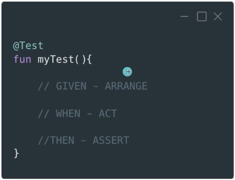

# 2. INTRODUCCIÓN AL TESTING

## ¿Qué son los tests?:

- Ayudan a comprobar que nuestro código hace lo que tiene que hacer.
- Permiten desarrollar funcionalidades de manera completa, sin tener que probar manualmente cada camino.
- Nos obligan a crear código de calidad:
	- Cumplir principios SOLID.
	- Detectar code smells.
- Más seguridad si queremos refactorizar el código.

## Reglas FIRST:

- Son un conjunto de principios que se utilizan para diseñar y escribir tests de software de forma efectiva. 
- FIRST:
	- Fast
	- Isolated / Independent
	- Reliable / Repeteable
	- Self-contained / Self-validating
	- Timely / Thorough

## Tipos de tests:

- Unitarios:
	- Prueban una única entidad.
	- El resto de entidades:
		- Se mockean.
		- Se proveen implementaciones propias.
	- Son rápidos.
	- Son los más sencillos para empezar.
	- Cuando escribimos tests unitarios estamos testeando dando por hecho cómo se comunica el exterior con nuestra entidad, por tanto son necesarios pero no suficientes.
	- *Se ejecutan en local.*
	- Utilizaremos JUnit.
- De integración:
	- Comprueban cómo interactúan 2 o más entidades.
	- Inconveniente: Si fallan, no permiten detectar el punto de fallo (por eso son necesarios los tests unitarios).
	- Son menos propensos a modificaciones cuando el código cambia.
	- Muchos los incluyen como un tipo de Unit tests.
	- *Se ejecutan en local.*
	- Utilizaremos JUnit.
- De UI:
	- Comprueban la interfaz de usuario, cosas como que:
		- Al realizar una acción, se actualiza.
		- Los componentes están bien posicionados.
	- Son mucho más lentos y frágiles.
	- *Se ejecutan en dispositivo (instrumentación).*
	- Utilizaremos Espresso para las vistas clásicas, y para Compose, la propia librería de testing de Compose.

## TDD:

- Los tests se escriben antes que el código que los valida.
- Permite crear código ya testeado desde el principio:
	- Más robusto.
	- Código que tiende naturalmente a Clean y SOLID.
	- Los edge cases se detectan mejor.
- Inconvenientes:
	- Obliga a ejecutar mucho los tests: con Android no es especialmente rápido.
	- Hay que escribir tests de todo. Incluso algunos tests que puede que no nos aporten nada.
	- No es muy sencillo de implementar cuando estás empezando con el testing.

## ¿Qué debería testear?:

- Hay varias filosofías:
	- 100% covearge.
		- Puede dar una falsa sensación de seguridad. Que en los tests se ejecuten el 100% de las lineas de código no quiere decir que todo esté probado.
	- 100% de posibles estados.
	- Testear solo lo que aporte valor.
	- Crear tests de los bugs que se produzcan.

## Las dos corrientes del testing:

- LONDRES o Mockist:
	- Es la más moderna. Surgió entre el grupo de personas que inventó el concepto de mocking.
	- Rara vez usan clases reales en las dependencias para los tests.
	- La mayoría de las veces usan exclusivamente mocks como test doubles en los tests unitarios.
	- Los tests unitarios afectan a calses individuales (incluso funciones), el resto se mockea para testear la clase de forma aislada.
	- Un test de integración es un test en el que hay más de una clase real involucrada.
	- Tiende más a los tests de caja blanca.

- DETROIT o Classic/Classicist
	- Siempre usan clases reales en los tests cuando es posible.
	- Si no, recurren a dobles de tests hechos a mano.
	- Un test unitario no tiene por qué afectar a una única clase. De hecho, lo normal es que colaboren varias clases en el test, debido al primer punto.
	- Lo que realmente identifica un test unitario es que se ejecute de forma aislada y no afecte a otros tests.
	- Un test de integración prueba cómo se comporta nuestro código con sistemas de memoria compartida (bases de datos, acceso a servidores, etc), y cuanto más reales sean esos sistemas, mejor.
	- Tiende más a los tests de caja negra.

## Estructura de un test:

1. Condiguración: Given/Arrange
2. Ejecución: When/Act
3. Verificación: Then/Assert

