# 1. REPASO DE LA AQUITECTURA

## Por qué es importante la arquitectura:

- La arquitectura al final es un conjunto de estructuras, y una definición de como esas estructuras interactúan entre ellas. Esto nos proporciona:
	- `Reglas para crear nuevo código`: menos decisiones que tomar a medida que generemos nuevo código, ya que esas decisiones ya están tomadas y consensuadas previamente. Desarrollo más rápido y revisión más rápida.
	- `Lenguaje para comunicarse`: más fluidez en la comunicación.

- La arquitectura también es muy importante en el testing. Nos permite:
	- Desacoplar componentes.
	- Probarlos de forma individualizada.
	- Más sencillez de los tests.

## Divisón por capas:

- Podemos dividir la aplicación en capas, donde cada capa tendrá ciertas responsabilidades, de tal forma que cada capa sea independiente de las otras, lo que nos permite testearlas de forma independiente.

- División por capas que recomienda Google:

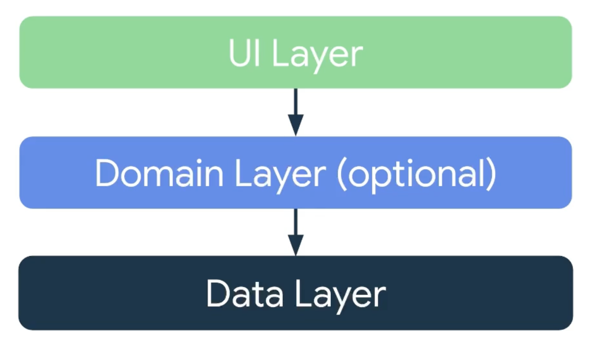

## Capa de UI:

- Se basa principalmente la siguiente estructura:

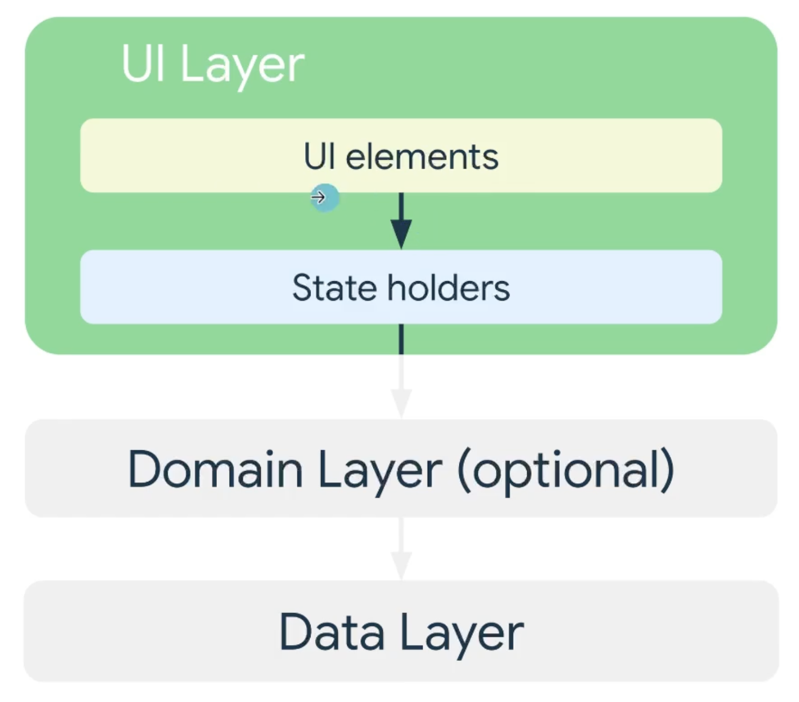

---------------------------------------------------------

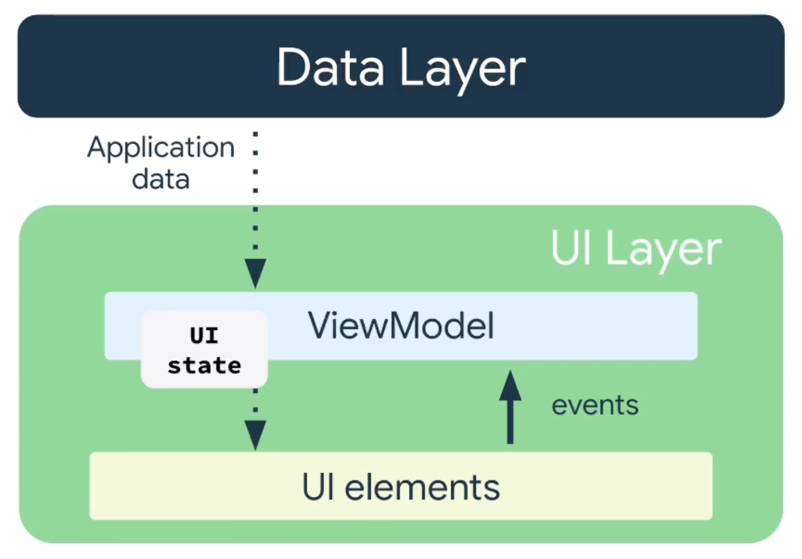

## Capa de Datos:

- Se basa princpialmente en la siguiente estructura:

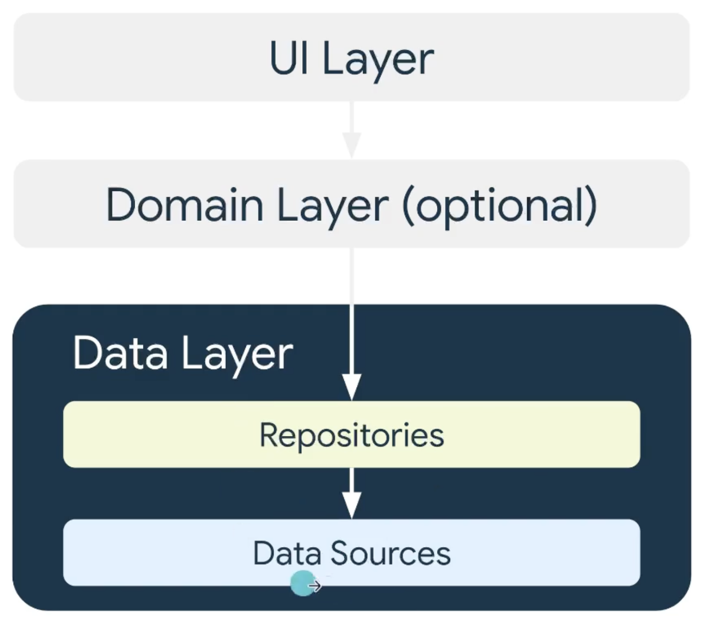

---------------------------------------------------------

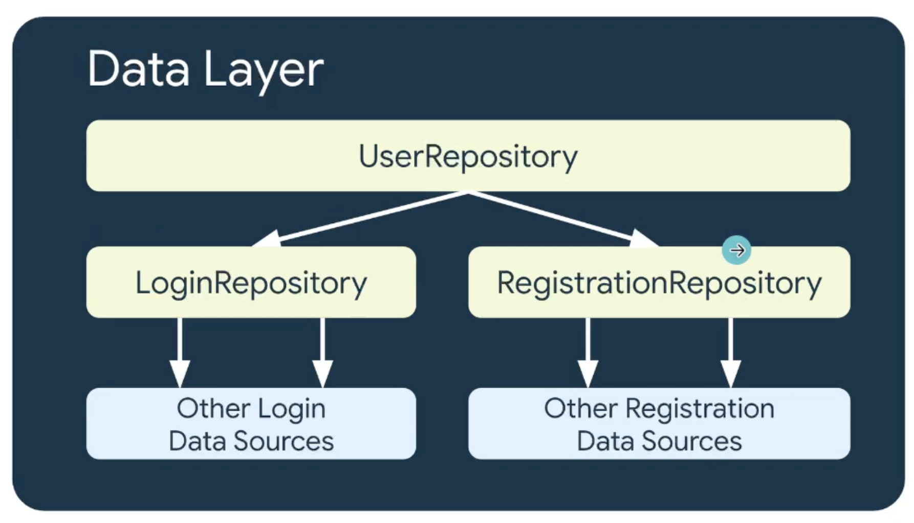

- Funciones de la capa de datos:
	- Notificar de los cambios en la información, a través de funciones `suspend` en caso de operaciones únicas, o `flows` en caso de varios valores.
	- Todas los métodos en esta capa tienen que ser seguros para llamarlos desde el Main thread. Esto quiere decir que si es necesario cambiar de hilo para la ejecución, será la capa de datos la encargada de cambiar el hilo de ejecución.

- En la capa de datos puede haber una BD, en este caso utilizaremos `room`:

	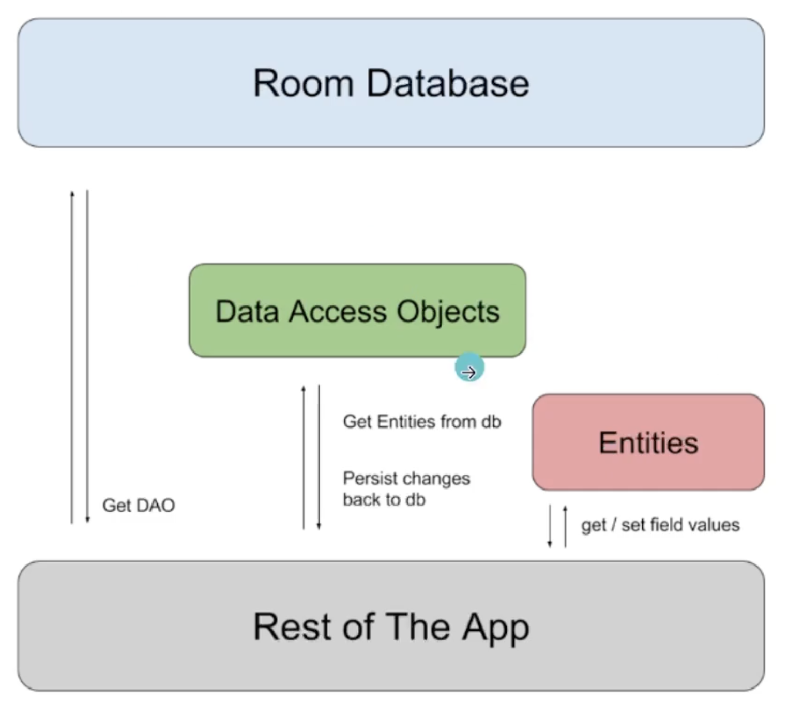

	- `Entities`: las tablas de una BD.
	- `Data Acces Objects`: como accedemos a esas tablas o entities. Lenguaje SQL. En el caso de los DAOs, peticiones en SQL representadas como una función (mapean la función con la petición SQL).
	- `Room Database`: la BD completa.

- Para acceder a datos remotos, en este caso vamos a utilizar `retrofit`: Nos permite definir una interfaz que mapee las peticiones al servidor a través de funciones.

- En el acceso a datos, siempre debe haber una única fuente de verdad. Que la información que muestre la UI venga de solo un sitio, porque sino lo que puede pasar es que haya desincronización en los datos que se muestran.

## Capa de Dominio:

- Mediante esta capa los `ViewModels` (capa UI) se comunicaran con los datos (capa datos).

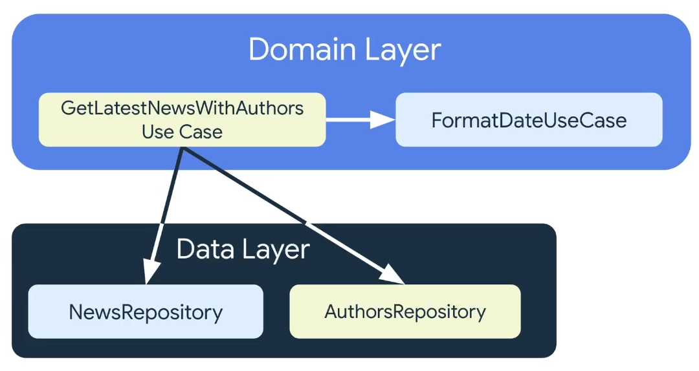

- Con esta capa podremos reutilizar un caso de uso, en caso de que se utilice en varias pantallas.

- Un caso de uso puede depender de otros casos de uso y utilizarlos según los necesite o proveerse con acceso a la capa de datos a través de los repositorios.

- Un caso de uso puede tener uno, o varios repositorios según los necesite.

## Clean Architecture:

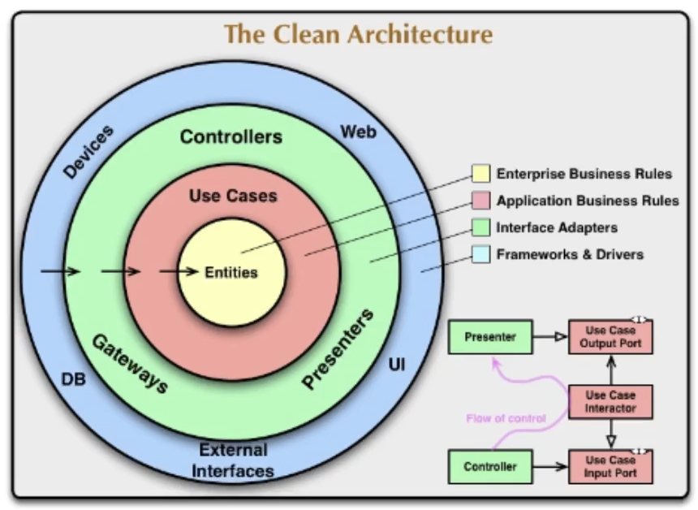
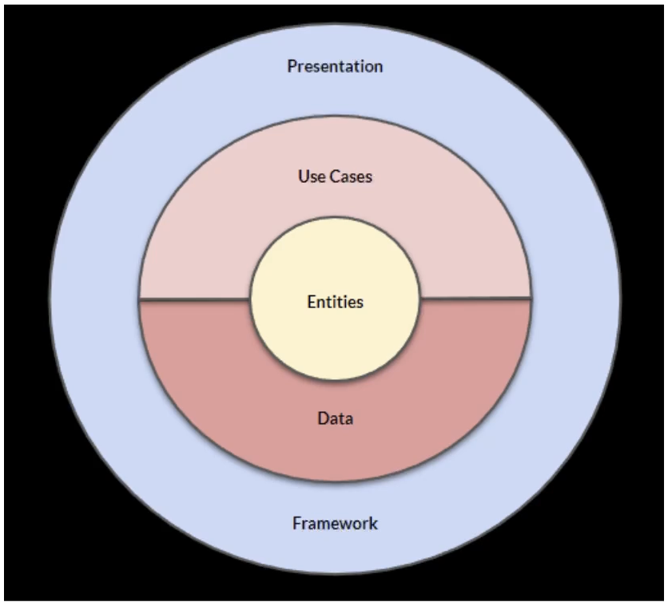

- `Capa de Presentación` (Presentation en el esquema 2): Donde tenemos tanto la UI como los ViewModels.
- `Capa de Casos de Uso` (Use Cases en el esquema 2): 
- `Capa de Casos Datos` (Data en el esquema 2): 
- `Capa de Entities o de Domain` (Entities en el esquema 2): Se almacena las entidades propias de nuestro negocio y también toda la lógica de negocio. Entendiendo como lógica de negocio, todo ese código que representa cosas que tendría que hacer cualquier aplicación que implementaramos en nuestro negocio. Algoritmos típicos de cálculo de datos, modelos de nuestra aplicación, etc.
- `Capa de Framework` (Framework en el esquema 2): La parte en la que se interactúa con todas las librerías de terceros.

- Un esquema más específico para el ejemplo que veremos:
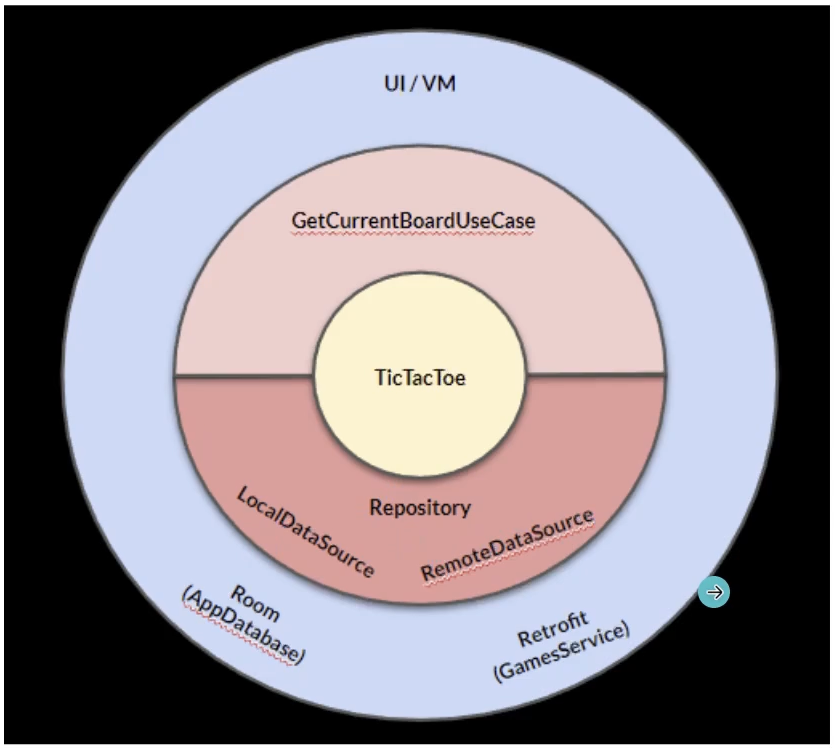

### Conceptos en clean architecture:

- `Capas`: Unidades de lógica común que se comunican con otras capas mediante fronteras. Esto nos permite limitar la visibilidad.
- `Interacción`: Cómo las capas interactúan entre sí. Las capas más internas no conocen a las externas, aunque hay interacciones que si que tienen que ir hacia fuera. Para ello, invertimos las dependencias.
- `Fronteras`: Puntos de conexión entre las distintas capas. 
	- `Dependencia directa`: pueden ser clases concretas.
	- `Dependencia invertida`: interfaz con la que comunicarse. La capa interna define una interfaz, y la capa externa la implementa.

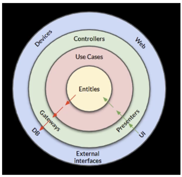

- `Modelos`: Estructuras de datos de cada capa. Transformaciones al pasar de una capa a otra (mapper).

