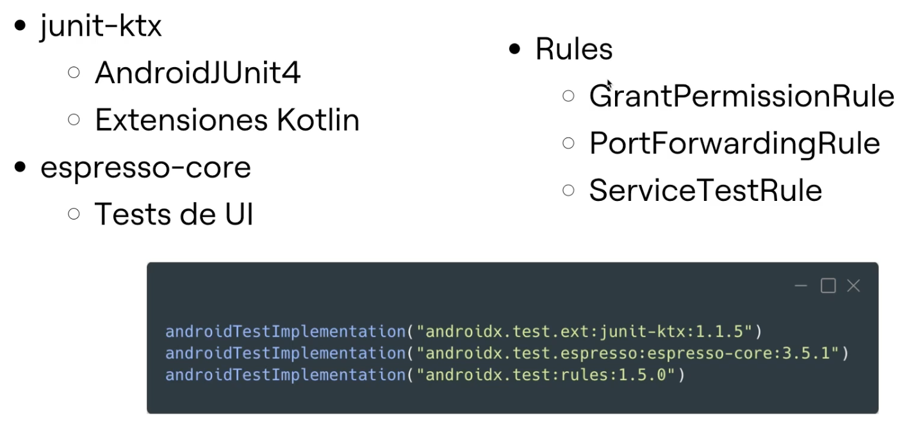
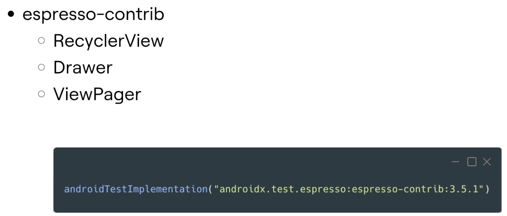
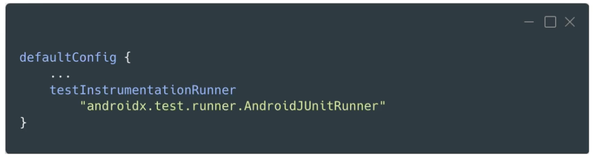

# 6. CONFIGURACIÓN DE HERRAMIENTAS PARA TESTS 

## Tests de integración: ¿ahora sí?:

- En Android necesitamos que sean tests de instrumentación.

- Tanto Hilt como Room necesitan el framework de Android para poder trabajar.

## Configurar tests de instrumentación:
  
  
  