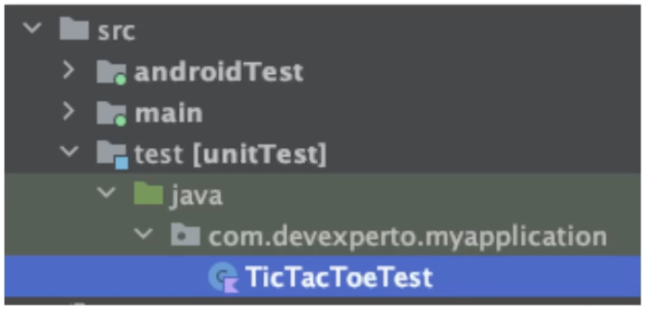
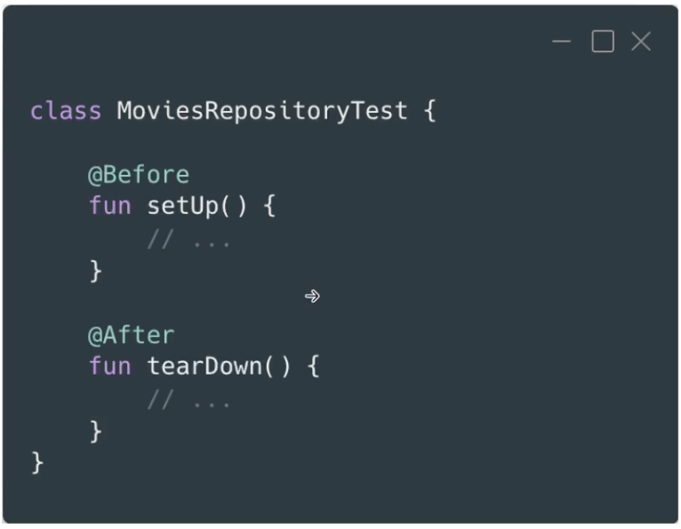
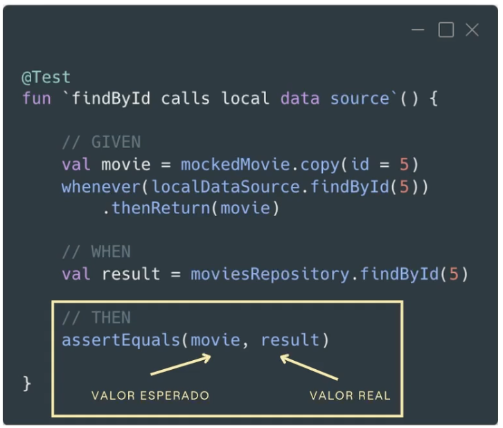
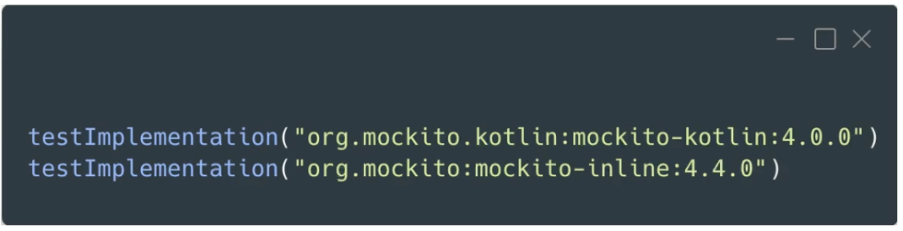
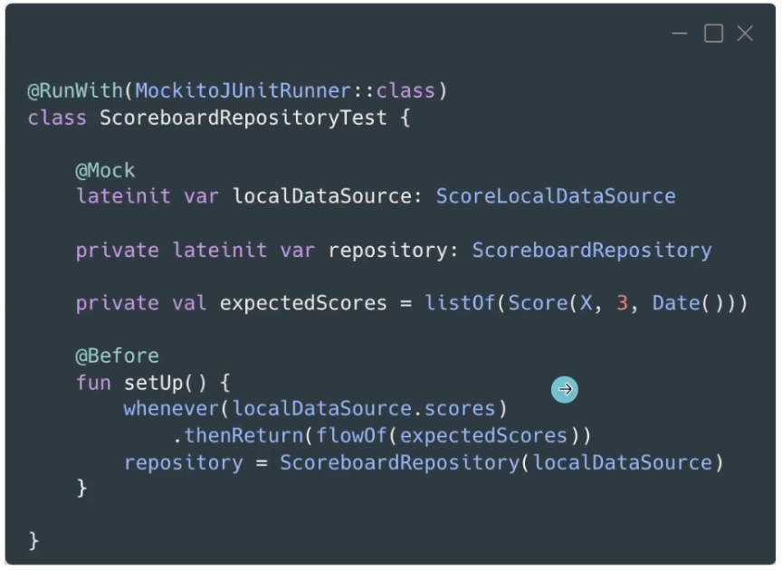
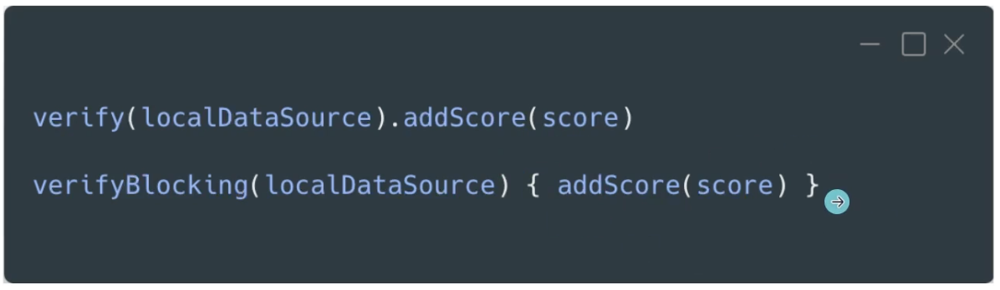
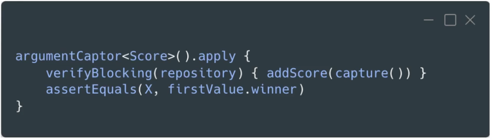

# 4. TESTS UNITARIOS

## Qué son los tests unitarios:

- Nos permiten probar una única entidad de forma aislada. Sin que el código de otras entidades afecte sobre el test de la entidad en cuestión. De forma que si algo falla, sabemos seguro que es debido a la entidad que estamos testeando en particular.

- El resto de entidades:
	- Se mockean.
	- Se proveen implementaciones propias.

- Ventajas: son rápidos y sencillos.

## JUnit

- Framework que permite la ejecución de las clases de forma controlada. Cuando ejecutamos un test, ese test se ejecuta en un entorno con un principio y un fin en el que podemos hacer anclajes sobre los distintos pasos de ejecución, y JUnit nos permite realizar acciones en cada uno de esos pasos.

- Permite evaluar el comportamiento de las clases que ejecutamos de forma controlada.

- Conclusión: JUnit genera un entorno de ejecución donde las clases se pueden testear de forma aislada.

- Es necesario añadir la librería:
	

- Por defecto los tests deben ir bajo la carpeta `test` que hay dentro de `src`. Se puede modificar mediante `gradle`.
	

## Estructura de los tests

- Dentro de la clase tendremos un par de funciones opcionales que nos permitirán ejecutar acciones justo antes y después de cada test. Si por ejemplo dentro de una clase tenemos cuatro funciones marcadas con el `@Test`, la función marcada con `@Before` se ejecutará cuatro veces, una antes de cada test, y de la misma manera para la función marcada con `@After`:
	

- Después añadimos los tests necesarios:
	

## Mockito

- Framework para crear mocks de forma automática.

- Permiten verificar qué funciones han sido llamadas, cuántas veces y con qué valores.

- Para utilizar Mockito tenemos que añadir dos librerías:
	
	* En principio para ls versión 5.0.0 de Mockito Kotlin, ya utiliza y añade por su cuenta Mockito inline, de manera que sería suficiente con solo añadir la librería para Mockito Kotlin.

- Hay dos formas de usar Mockito: 
	- Con anotaciones.
	- Con un DSL.

- Mockito con anotaciones:
	- Primero indicamos que los test se van a ejecutar con el `MockitoJUnitRunner`, que es un runner especial de Mockito capaz de leer las anotaciones e inyectar los mocks en los puntos donde indiquemos.
	- Cuando queremos crear un mock lo indicamos con la anotación `@Mock`. Luego en la función de `setUp` le damos los valores que queramos al mock (o en el given/arrange dentro de cada test).
	

- Mockito con DSL:
	- Utilizamos la función `mock` y abrimos llaves para indicarle los valores que queremos de retorno.
	

- Verificaciones:
	- Utilizamos las funciones, `verify` y `verifyBlocking` para corrutinas.
	

	- Con estas funciones podemos comprobar si un valor es uno en concreto, o que se ha llamado a una función con cualquier tipo de objeto, y también cuantas veces se ha llamado a esa función con ese valor.

- Argument Captor: esta funcionalidad nos permite capturar los valores con los que se llama a una función y hacer aserciones sobre ese valor capturado.
	

