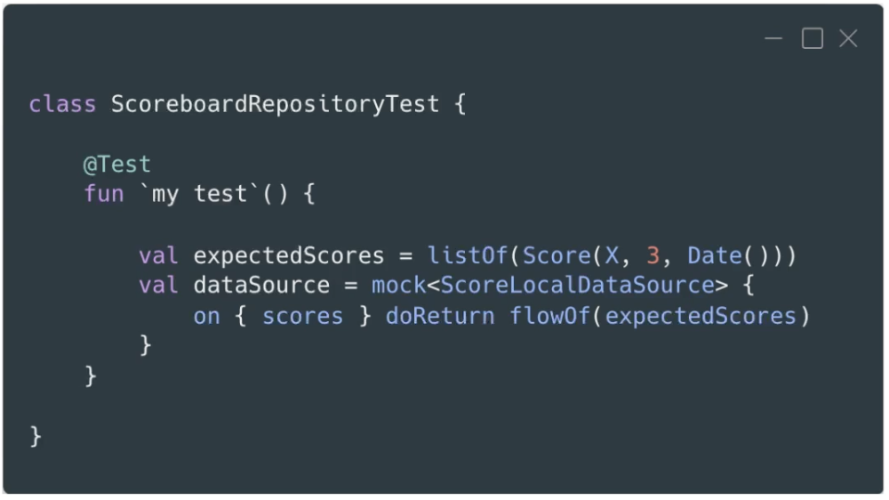
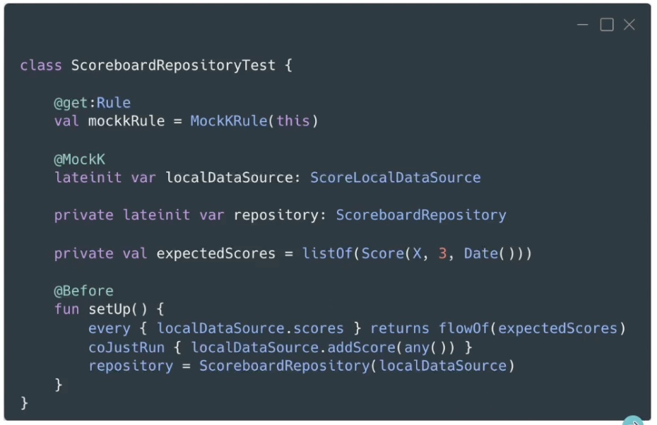

# 4. TESTS UNITARIOS


## Qué son los tests unitarios:

- Nos permiten probar una única entidad de forma aislada. Sin que el código de otras entidades afecte sobre el test de la entidad en cuestión. De forma que si algo falla, sabemos seguro que es debido a la entidad que estamos testeando en particular.

- El resto de entidades:
	- Se mockean.
	- Se proveen implementaciones propias.

- Ventajas: son rápidos y sencillos.


## JUnit

- Framework que permite la ejecución de las clases de forma controlada. Cuando ejecutamos un test, ese test se ejecuta en un entorno con un principio y un fin en el que podemos hacer anclajes sobre los distintos pasos de ejecución, y JUnit nos permite realizar acciones en cada uno de esos pasos.

- Permite evaluar el comportamiento de las clases que ejecutamos de forma controlada.

- Conclusión: JUnit genera un entorno de ejecución donde las clases se pueden testear de forma aislada.

- Es necesario añadir la librería:
	

- Por defecto los tests deben ir bajo la carpeta `test` que hay dentro de `src`. Se puede modificar mediante `gradle`.
	


## Estructura de los tests

- Dentro de la clase tendremos un par de funciones opcionales que nos permitirán ejecutar acciones justo antes y después de cada test. Si por ejemplo dentro de una clase tenemos cuatro funciones marcadas con el `@Test`, la función marcada con `@Before` se ejecutará cuatro veces, una antes de cada test, y de la misma manera para la función marcada con `@After`:
	


- Después añadimos los tests necesarios:
	


## Mockito

- Framework para crear mocks de forma automática.

- Permiten verificar qué funciones han sido llamadas, cuántas veces y con qué valores.

- Para utilizar Mockito tenemos que añadir dos librerías:
	
	* En principio para ls versión 5.0.0 de Mockito Kotlin, ya utiliza y añade por su cuenta Mockito inline, de manera que sería suficiente con solo añadir la librería para Mockito Kotlin.

- Hay dos formas de usar Mockito: 
	- Con anotaciones.
	- Con un DSL.

- Mockito con anotaciones:
	- Primero indicamos que los test se van a ejecutar con el `MockitoJUnitRunner`, que es un runner especial de Mockito capaz de leer las anotaciones e inyectar los mocks en los puntos donde indiquemos.
	- Cuando queremos crear un mock lo indicamos con la anotación `@Mock`. Luego en la función de `setUp` le damos los valores que queramos al mock (o en el given/arrange dentro de cada test).
	

- Mockito con DSL:
	- Utilizamos la función `mock` y abrimos llaves para indicarle los valores que queremos de retorno.
	

- Verificaciones:
	- Utilizamos las funciones, `verify` y `verifyBlocking` para corrutinas.
	

	- Con estas funciones podemos comprobar si un valor es uno en concreto, o que se ha llamado a una función con cualquier tipo de objeto, y también cuantas veces se ha llamado a esa función con ese valor.

- Argument Captor: esta funcionalidad nos permite capturar los valores con los que se llama a una función y hacer aserciones sobre ese valor capturado.
	


## MockK

- Alternativa a Mockito enteramente escrita en Kotlin.

- Tiene en cuenta las pequeñas diferencias que encontramos entre Kotlin y Java:
	- MockK no da valores por defecto (exc. relaxed).
	- Mejor gestión de nulos.

- Para utilizarlo añadimos la librería:
	

- Se puede utilizar con anotaciones o con DSL. (Hay una tendencia a utilizar Mockito siempre con anotaciones y MockK siempre con DSL, pero las dos soportan las dos opciones).

- Como MockK no da valores por defecto, debemos mockear todas las funciones que vayan a ser llamadas, porque en Kotlin no existe el concepto de que una función no devuelva nada, cuando "no devuelve nada" en realidad devuelve `Unit`.

- MockK con anotaciones:
	- En vez de utilizar un runner especial, se utiliza una `Rule`. Para todas las clases de test donde vayamos a utilizar MockK mediante anotaciones tenemos que especificar la `MockKRule`. Esta rule será la encargada de inyectar los valores donde pongamos las anotaciones `@MockK`. 
	- Finalmente en el setUp especificamos los valores que necesitamos de retorno.
		

- MockK con DSL:
	

- Verificaciones:
	- Utilizamos las funciones, `verify` y `coVerify` para corrutinas.
	

- En MockK por defecto los mocks no dan valores a las funciones ni a las properties. Existe una forma de MockK se comporte como Mockito en el sentido de que cuando no tengamos un valor de retorno para una función o propiedad, le de uno por defecto. Para esto utilizamos los siguientes argumentos al crear el mock: 
	- `relaxed`: valores por defecto para todas las funciones y properties.
	- `relaxedUnitFun`: valores por defecto solo para funciones que devuelven Unit.

- Argument Captor: En este caso se llaman `Slots`. Creamos un slot del objeto que queremos capturar.
	


## Problemática en los tests de ViewModels

- En los ViewModels, podemos usar LiveData o StateFlow para gestionar el estado de forma eficiente y reactiva.

- En el caso de LiveData tenemos dos principales para realizar los tests:
	- Primer problema: LiveData siempre busca el `main thread` para ejecutar los observers. Esto falla en los tests, ya que los tests que se ejecutan en nuestra máquina, no tiene  en el hilo principal, y cuando los LiveData traten de buscar ese hilo principal en la ejecución de tests, dará error.
		- Para solucionar esto, podemos incluir la siguiente la siguiente librería y utilizar la rule a continuación:
			
		Con esto el LiveData utilizará el hilo del test, en vez de el principal.

	- Segundo problema: para testear, observamos el LiveData, pero no tenemos un Lifecycle. El método `observe` del LiveData, pide un lifecycle owner, y esto no lo tenemos durante los tests.
		- Para solucionar esto, en vez de utilizar el método `observe` utilizamos el `observeForever`. Esto lo que va a hacer es observar el LiveData durante todo el tiempo que dure el test.
			
		Cada test tiene su propio contexto de ejecución. Cuando se ejecute un nuevo test, la anotación de `@Mock` creará un nuevo mock observer y por tanto cada test observará con un observer nuevo.

- Problemas en el caso de StateFlows:
	- Utilizan corrutinas:
		- Las corrutinas se lanzan en el hilo principal (viewModelScope). Por tanto tenemos el mismo problema que con LiveData, no disponemos del hilo principal en el entorno de tests. Es decir, si lanzamos una corrutina utilizando el `MainDispatcher` esto nos producirá un error en tests.
		- No tenemos control sobre los hilos secundarios (el resto de dispatchers: `DispatcherIO`, `DispatcherDefault`...): por tanto no es tan sencillo esperar a que acaben antes de que acabe el test y `runBlocking` no siempre es suficiente.
	- Algunas propiedades de los StateFlows:
		- Los StateFlows son `conflated`, esto quiere decir que los valores intermedios se pierden si el observador es más lento que el emisor. Esto a nivel de tests puede ser un inconveniente ya que a veces podemos necesitar saber cuales han sido los valores intermedios.


## Rules

- Son puntos de control donde podemos ejecutar código en función de la situación actual del test.

- Simplifican la reutilización de código:
	- Control antes y después del test.
	- Sustituyen `@Before` y `@After`.

- Algunas de las librerías nos proporcionan algunas rules, por ejemplo la que ya hemos mencionado:
	

- También podemos crear nuestras propias rules:
	

- Para definir el orden de ejecución podemos utilizar el argumento que recibe la anotación rule.
	


## Tests de ViewModels


- Ejemplo de test para `GamesViewModel`:
	- Como utilizamos corutinas, hacemos uso de las rules previamente creadas para sustituir el hilo principal por el hilo de tests.
	- Como llamamos a funciones `suspend` necesitamos estar en un bloque de corutinas. El sustituto del `runBlocking` en los test, es `runTest`. Este último no va a empezar a ejecutar las funciones `suspend` hasta que no avancemos en el tiempo dentro de los tests, lo que nos permite posicionarnos en ciertos momentos del tiempo, y hacer comprobaciones en ese momento particular.

	```
	@OptIn(ExperimentalCoroutinesApi::class)
	class GamesViewModelTest {

    	@get:Rule
    	val coroutinesTestRule = CoroutinesTestRule()

    	@Test
    	fun `when view model is created, then call get games`() = runTest {
        	val expectedGames = listOf(VideoGame(1, "name", 1.0, "image", Date()))
        	val getPopularGamesUseCase: GetPopularGamesUseCase = mockk()
        	every { getPopularGamesUseCase() } returns flowOf(expectedGames)
        	val viewModel = GamesViewModel(getPopularGamesUseCase)

        	viewModel.state.test {
            	assertEquals(GamesViewModel.UiState(), awaitItem())

            	viewModel.onUiReady()
            	assertEquals(GamesViewModel.UiState(isLoading = true), awaitItem())
            	assertEquals(GamesViewModel.UiState(games = expectedGames), awaitItem())
        	}

    	}
	}
	```	

	```
	@HiltViewModel
	class GamesViewModel @Inject constructor(
    	private val getPopularGamesUseCase: GetPopularGamesUseCase
	) :
    	ViewModel() {

    	private val _state = MutableStateFlow(UiState())
    	val state = _state.asStateFlow()

    	fun onUiReady() {
        	viewModelScope.launch {
            	_state.value = UiState(isLoading = true)
            	getPopularGamesUseCase().collect {
                	_state.value = UiState(games = it, isLoading = false)
            	}
        	}
    	}

    	data class UiState(
        	val games: List<VideoGame> = emptyList(),
        	val isLoading: Boolean = false,
    	)
	}
	```

	```
	@OptIn(ExperimentalCoroutinesApi::class)
	class CoroutinesTestRule : TestWatcher() {

    	val testDispatcher = StandardTestDispatcher()

    	override fun starting(description: Description) {
        	super.starting(description)
        	Dispatchers.setMain(testDispatcher)
    	}

    	override fun finished(description: Description) {
        	super.finished(description)
        	Dispatchers.resetMain()
    	}
	}
	```


- Ejemplo de test para `BoardViewModel`:
	
	```
	@OptIn(ExperimentalCoroutinesApi::class)
	class BoardViewModelTest {

    	@get:Rule
    	val coroutinesTestRule = CoroutinesTestRule()

    	@get:Rule
    	val mockkRule = MockKRule(this)

    	@MockK
    	lateinit var makeBoardMoveUseCase: MakeBoardMoveUseCase

    	@MockK
    	lateinit var getCurrentBoardUseCase: GetCurrentBoardUseCase

    	@MockK
    	lateinit var addScoreUseCase: AddScoreUseCase

    	@MockK
    	lateinit var resetBoardUseCase: ResetBoardUseCase

    	ateinit var viewModel: BoardViewModel

    	@Before
    	fun setUp() {
        	every { getCurrentBoardUseCase() } returns flowOf(TicTacToe())
        	viewModel = BoardViewModel(
            	makeBoardMoveUseCase,
            	getCurrentBoardUseCase,
            	addScoreUseCase,
            	resetBoardUseCase
        	)
    	}

    	@Test
    	fun `at the beginning, the game is not started`() = runTest {
        	assertEquals(GameState.NotStarted, viewModel.state.value.gameState)
    	}

    	@Test
   		fun `when start game is called, game state is in progress`() = runTest {
        	viewModel.startGame()

        	runCurrent()

        	assertEquals(GameState.InProgress, viewModel.state.value.gameState)
    	}

    	@Test
    	fun `when reset is called, then the game is cleared`() = runTest {
        	coJustRun { resetBoardUseCase() }

        	viewModel.resetGame()

        	runCurrent()

        	coVerify { resetBoardUseCase() }
    	}

    	@Test
    	fun `move is recorded by use case`() = runTest {

        	val slot1 = slot<Int>()
        	val slot2 = slot<Int>()
        	coJustRun { makeBoardMoveUseCase(capture(slot1), capture(slot2)) }

        	viewModel.move(0, 1)

        	runCurrent()

        	assertEquals(0, slot1.captured)
        	assertEquals(1, slot2.captured)
    	}
	}
	```

	```
	@HiltViewModel
	class BoardViewModel @Inject constructor(
    	private val makeBoardMoveUseCase: MakeBoardMoveUseCase,
    	private val getCurrentBoardUseCase: GetCurrentBoardUseCase,
    	private val addScoreUseCase: AddScoreUseCase,
    	private val resetBoardUseCase: ResetBoardUseCase
	) : ViewModel() {

    	private val _state = MutableStateFlow(UiState())
    	val state = _state .asStateFlow()

    	fun startGame() {
        	viewModelScope.launch {
            	getCurrentBoardUseCase().collect { board ->
                	_state.value = UiState(
                    	ticTacToe = board,
                    	gameState = when (val winner = board.findWinner()) {
                        	null -> GameState.InProgress
                        	else -> {
                            	addScoreUseCase(board)
                            	GameState.Finished(winner)
                        	}
                    	}
                	)
            	}
        	}
    	}

    	fun move(row: Int, column: Int) {
        	viewModelScope.launch {
            	makeBoardMoveUseCase(row, column)
        	}
    	}

    	fun resetGame() {
        	viewModelScope.launch {
            	resetBoardUseCase()
            	startGame()
        	}
    	}

    	data class UiState(
        	val ticTacToe: TicTacToe = TicTacToe(),
        	val gameState: GameState = GameState.NotStarted
    	)
	}
	```


