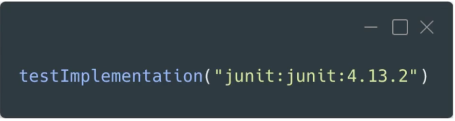

# 4. TESTS UNITARIOS

## Qué son los tests unitarios:

- Nos permiten probar una única entidad de forma aislada. Sin que el código de otras entidades afecte sobre el test de la entidad en cuestión. De forma que si algo falla, sabemos seguro que es debido a la entidad que estamos testeando en particular.

- El resto de entidades:
	- Se mockean.
	- Se proveen implementaciones propias.

- Ventajas: son rápidos y sencillos.

## JUnit

- Framework que permite la ejecución de las clases de forma controlada. Cuando ejecutamos un test, ese test se ejecuta en un entorno con un principio y un fin en el que podemos hacer anclajes sobre los distintos pasos de ejecución, y JUnit nos permite realizar acciones en cada uno de esos pasos.

- Permite evaluar el comportamiento de las clases que ejecutamos de forma controlada.

- Conclusión: JUnit genera un entorno de ejecución donde las clases se pueden testear de forma aislada.

- Es necesario añadir la librería:
	

- Por defecto los tests deben ir bajo la carpeta `test` que hay dentro de `src`. Se puede modificar mediante `gradle`.
	